// Add steps as necessary for accessing the software, post-configuration, and testing. Don’t include full usage instructions for your software, but add links to your product documentation for that information.
//Should any sections not be applicable, remove them

== Test the deployment
// If steps are required to test the deployment, add them here. If not, remove the heading
=== Main Template

After the deployment has completed, note the bastion host public IP address from the
*Outputs* tab.

[#testmain1]
.Bastion host IP address
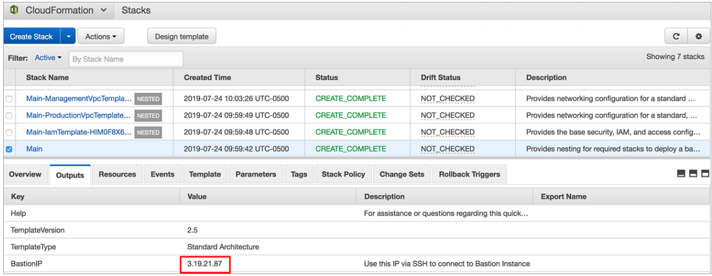

Select the nested templates, such as the Management VPC template, and view the resources
that were created.

[#testmain2]
.Management VPC resources
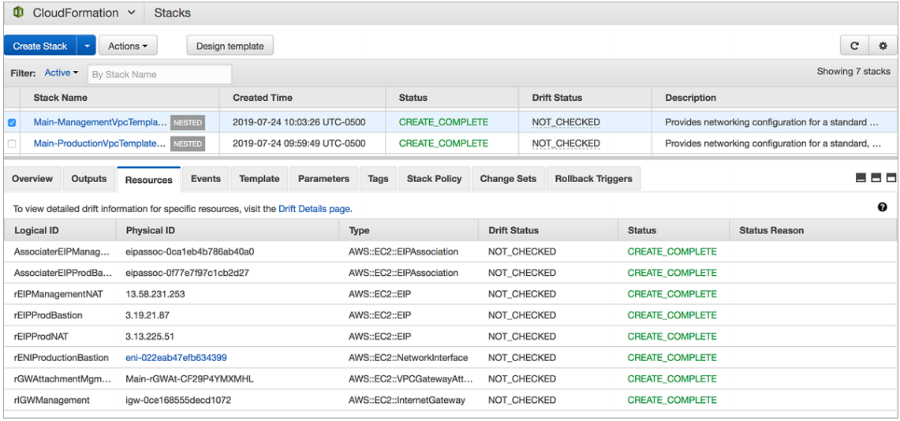

=== Centralized Logging Template

After the deployment has completed, view the *Outputs* tab and note the Amazon ES
domain endpoint, S3 bucket, and the login URL for the Kibana dashboard.

[#testcl1]
.Centralized logging outputs
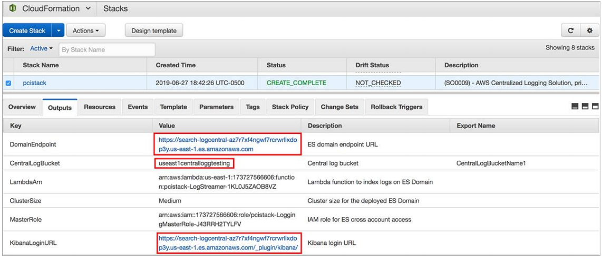

To login to the Kibana dashboard, use the temporary password that was sent to your email
address.

. After you are signed in, in the left navigation pane, choose Management.
. Under Configure an index pattern, set the Index name or pattern field to cwl-*
(the message box underneath should change from red to green, confirming that there
are matching indices and aliases). Then choose Next step.
. Under Time Filter, choose @timestamp.
. To see a list of every field in the index, choose Create index pattern.
. To start viewing logs, in the left navigation pane, choose Discover

[#testcl2]
.Kibana dashboard
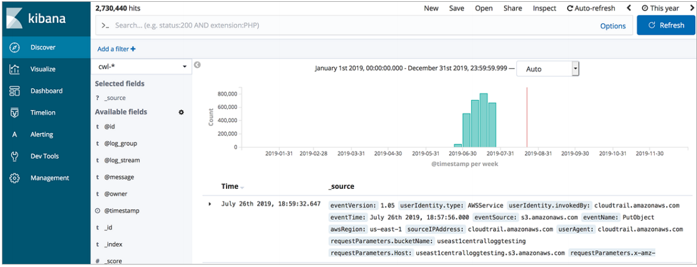

=== Database Template

After the deployment has completed, note the AWS KMS key alias, the database security
group, and the database name from the *Outputs* tab.

[#testdb1]
.Database template Outputs tab
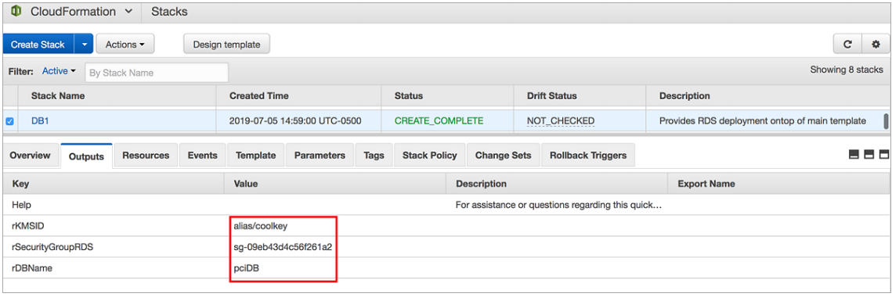

To retrieve the automatically generated PCI-compliant password, on the Secrets Manager
console, choose the secret that has the description *This is my pci db instance secret,
and choose Retrieve Secret Value.*

[#testdb2]
.Secrets Manager dashboard
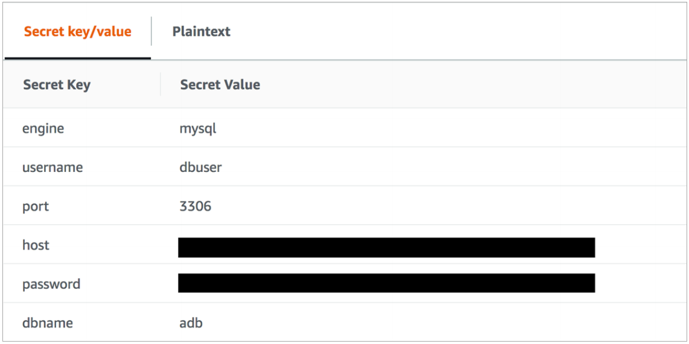

NOTE: In the *Rotation configuration* section, the value is set to 89 days and not
90. This is because Secrets Manager schedules the next rotation when the previous
one is complete. Secrets Manager schedules the date by adding the rotation interval
(number of days) to the actual date of the last rotation. The service chooses the hour
within that 24-hour date window randomly. The minute is also chosen randomly, but
it is weighted towards the top of the hour and influenced by a variety of factors that
help distribute load. For compliance requirements, it is recommended to set the
value at 1 day less than the requirement.

=== Web Application Template

After the deployment has completed, on the *Outputs* tab, choose the *LandingPageURL*
link.

[#testwa1]
.Opening the landing page
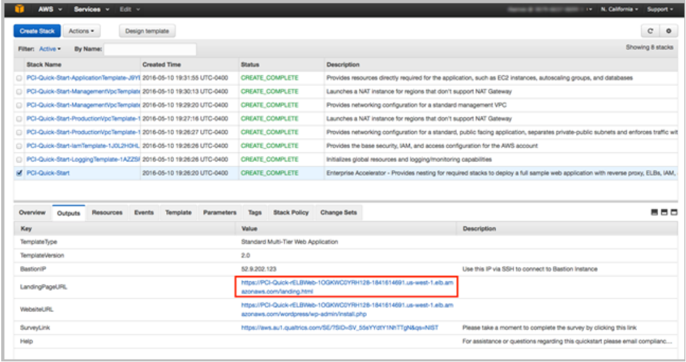

The link should launch a new page in your browser that looks similar to <<testwa2>>.

[#testwa2]
.Landing page for PCI architecture on AWS
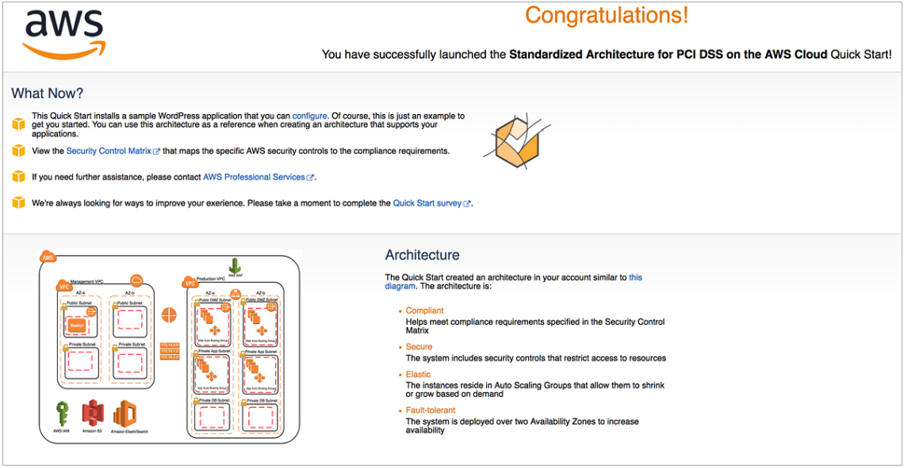

This deployment builds a working demo of a Multi-AZ WordPress site. To connect to the
WordPress site, on the *Outputs* tab, choose the *WebsiteURL* link. The *WebsiteURL*
link is also available on the *Outputs* tab for the main stack.

NOTE: WordPress is provided for testing and proof-of-concept purposes only; it is
not intended for production use. You can replace it with another application of your
choice.

[#testwa3]
.Installing WordPress 
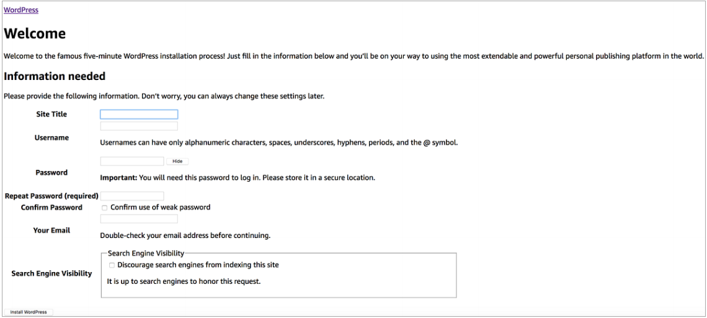

You can install and test the WordPress deployment from the page that loads. To access the
admin page when AWS WAF is deployed, you must add your IP address in the AWS WAF
rules. To allow your IP address, follow these steps:

. On the AWS WAF console, in the left navigation pane, choose *WebACL*.
. Choose the Region where you deployed the stack.
. Select the WebACL named *standard-owasp-acl.*
. In the left navigation pane, select *IP Addresses.*
. In the IP match conditions section, choose *standard-match-admin-remote-ip.*
. On the right side, choose *Add IP addresses or ranges.*
+
[#testwa4]
.Adding the IP address
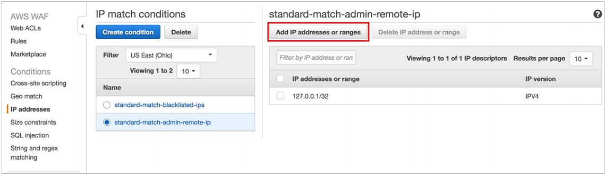
+
. Add your IP address or CIDR range to the allow list, and click *Add.*
. In the left navigation pane, choose *Rules.*
. Choose *standard-enforce-csrf.*
. On the right side, choose *Edit rule* then *Add condition.*
. Under *When a Request*, choose *does not, originate from an IP address in,
standard-match-admin-remote-ip.*
+
[#testwa5]
.Adding the IP Address condition
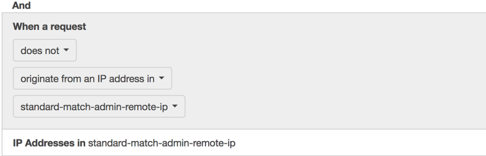
+
. Choose Update.

You should now be able to access and set up WordPress.

IMPORTANT: The WordPress application included in this Quick Start deployment is
for demo purposes only. Application-level security, including patching, operating
system updates, and addressing application vulnerabilities, is the customer’s
responsibility (see the AWS Shared Responsibility Model). 
For this Quick Start, we recommend that you *delete the AWS CloudFormation
stacks* after your proof-of-concept demo or testing is complete.

Now that you have deployed and tested the PCI architecture on AWS, please take a few
minutes to complete our https://aws.au1.qualtrics.com/SE/?SID=SV_55sYYdtY1NhTTgN&qs=pci[survey] for this Quick Start. Your response is anonymous and will
help us improve these reference deployments.

// == Post-deployment steps
// If post-deployment steps are required, add them here. If not, remove the heading

// == Best practices for using {partner-product-short-name} on AWS
// Provide post-deployment best practices for using the technology on AWS, including considerations such as migrating data, backups, ensuring high performance, high availability, etc. Link to software documentation for detailed information.

// _Add any best practices for using the software._

// == Security
// Provide post-deployment best practices for using the technology on AWS, including considerations such as migrating data, backups, ensuring high performance, high availability, etc. Link to software documentation for detailed information.

// _Add any security-related information._

== Other useful information
//Provide any other information of interest to users, especially focusing on areas where AWS or cloud usage differs from on-premises usage.

=== Integrating with AWS Service Catalog

You can add the AWS CloudFormation templates for this Quick Start to AWS Service
Catalog as portfolios or products to manage them from a central location. This helps
support consistent governance, security, and compliance requirements. It also enables you
to quickly deploy only the approved IT services they need.

For complete information about using AWS Service Catalog, see the http://aws.amazon.com/documentation/servicecatalog/[AWS documentation.]
The following table provides links for specific tasks.

[cols="50,50",grid=rows,frame=topbot, options="header"]
|===
|To 
|See

|Create a new portfolio 
|http://docs.aws.amazon.com/servicecatalog/latest/adminguide/portfoliomgmt-create.html[Creating and Deleting Portfolios]

|Create a new product 
|http://docs.aws.amazon.com/servicecatalog/latest/adminguide/portfoliomgmt-products.html[Adding and Removing Products]

|Give users access 
|http://docs.aws.amazon.com/servicecatalog/latest/adminguide/catalogs_portfolios_users.html[Granting Access to Users]

|Assign IAM roles for deploying stacks 
|http://docs.aws.amazon.com/servicecatalog/latest/adminguide/constraints-launch.html[Applying Launch Constraints] Make sure that the IAM role has a policy and trust relationship defined.

|Assign tags to portfolios to track resource ownership, access, and cost allocations
|http://docs.aws.amazon.com/servicecatalog/latest/adminguide/portfoliomgmt-tags.html[Tagging Portfolios]

|Perform other administrative tasks 
|http://docs.aws.amazon.com/servicecatalog/latest/adminguide/[AWS Service Catalog Administrator Guide]

|Launch products from AWS Service Catalog
|http://docs.aws.amazon.com/servicecatalog/latest/userguide/[AWS Service Catalog User Guide]

|===

