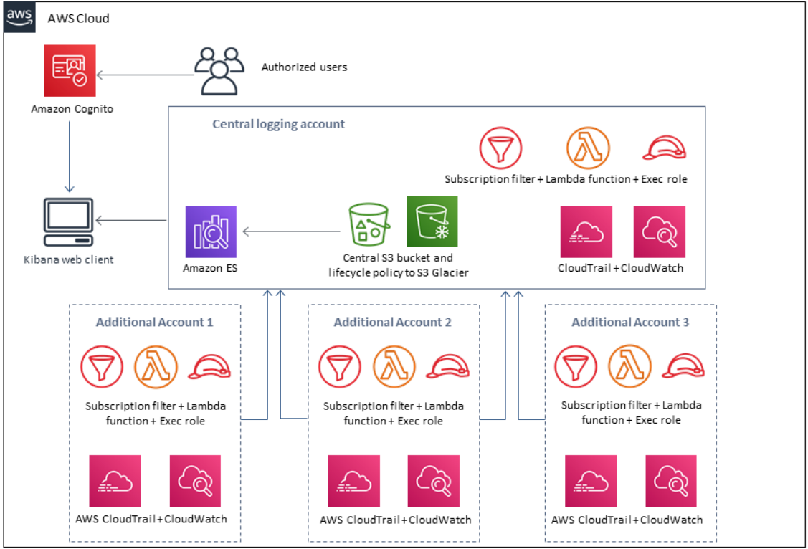
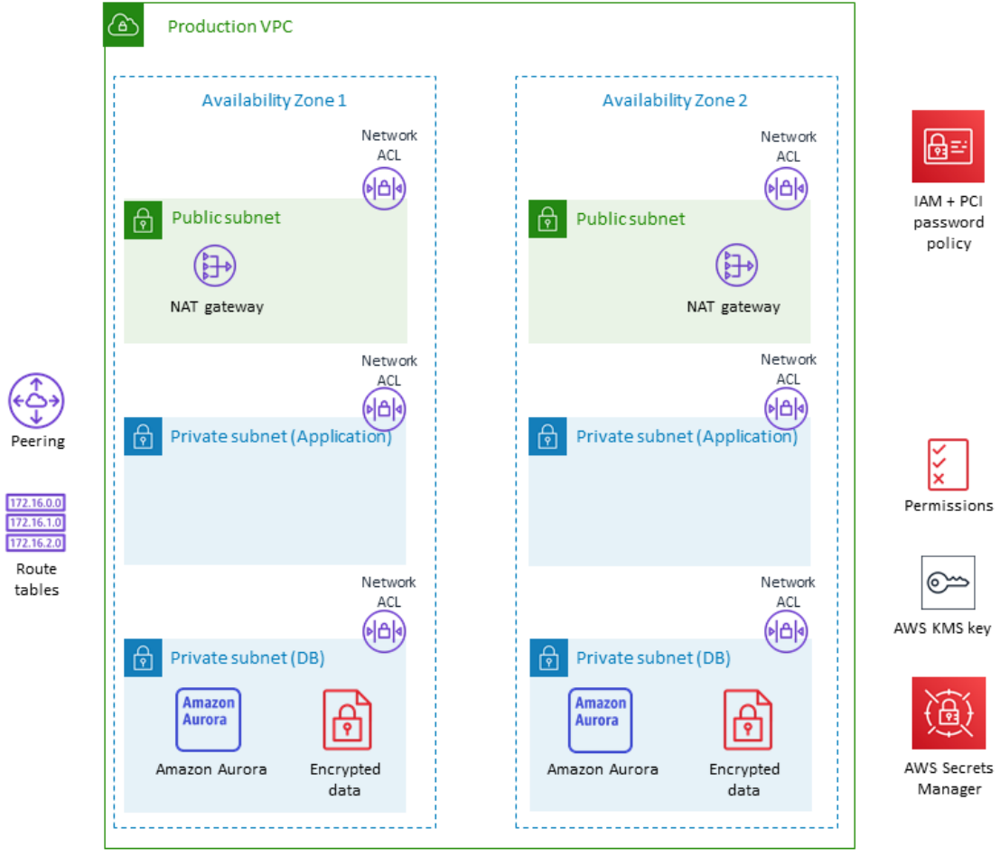
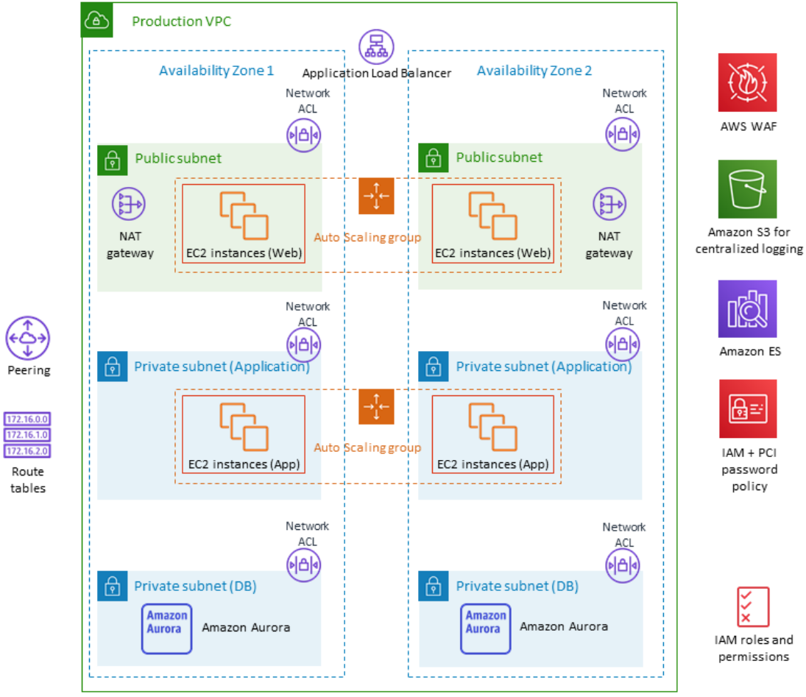

:xrefstyle: short

Deploying this Quick Start for a new virtual private cloud (VPC) with
default parameters builds the following {partner-product-short-name} environment in the
AWS Cloud.

// Replace this example diagram with your own. Follow our wiki guidelines: https://w.amazon.com/bin/view/AWS_Quick_Starts/Process_for_PSAs/#HPrepareyourarchitecturediagram. Upload your source PowerPoint file to the GitHub {deployment name}/docs/images/ directory in this repo. 

[#architecture1]
.Quick Start architecture for {partner-product-short-name} on AWS
image::../images/architecture_diagram.png[Architecture]

As shown in <<architecture1>>, the Quick Start sets up the following:

* A highly available architecture that spans two Availability Zones.*
* Two VPCs configured with public and private subnets, according to AWS
best practices, to provide you with your own virtual network on AWS.*
* In the public subnets:
** Managed network address translation (NAT) gateways to allow outbound
internet access for resources in the private subnets.*
** A Linux bastion host in an Auto Scaling group to allow inbound Secure
Shell (SSH) access to EC2 instances in public and private subnets.*
* Network access control list (network ACL) rules to filter traffic.
* Standard security groups for EC2 instances.
* Basic AWS Identity and Access Management (IAM) configuration with custom IAM
policies, with associated groups, roles, and instance profiles.
* PCI-compliant password policy.

// Add bullet points for any additional components that are included in the deployment. Make sure that the additional components are also represented in the architecture diagram. End each bullet with a period.
//* <describe any additional components>.

//[.small]#* The template that deploys the Quick Start into an existing VPC skips the components marked by asterisks and prompts you for your existing VPC configuration.#

### Centralized Logging Architecture

[#architecture2]
.Centralized logging architecture for {partner-product-short-name} on AWS

The centralized logging template architecture includes the following components and
features:

* Logging, monitoring, and alerts using CloudTrail, CloudWatch, and AWS Config rules
(optional), Amazon ES cluster with a Kibana front end for CloudTrail log analysis, with
Amazon Cognito for access control.

* Amazon S3 for centralized logging, utilizing lifecycle policies for archiving objects in
Amazon S3 Glacier, which supports PCI-compliant retention policies.

* A second template to forward CloudTrail logs to the main logging account from other
accounts (if applicable).

### Database Architecture

[#architecture3]
.Database architecture for {partner-product-short-name} on AWS

The database template architecture includes the following components and features:

* Encrypted, Multi-AZ Amazon RDS Aurora MySQL database cluster.

* Security group for the Amazon RDS database. The security group allows access only
through port 3306 and only from the specified VPC.

* AWS Key Management Service (AWS KMS) symmetric customer master key (CMK) with
user-defined key alias, and with automatic rotation enabled.

* IAM groups with usage permissions for Key Administrators and Key Users

* User-defined database user name and password.

* Secrets Manager set to rotate the database password every 89 days.

### Web Application Architecture

[#architecture4]
.Web application architecture for {partner-product-short-name} on AWS

The web application template architecture includes the following components and features:

* Three-tier Linux web application using Auto Scaling and an Application Load Balancer,
which can be modified or bootstrapped with the your application.S3 buckets for
encrypted web content, centralized logging, and AWS WAF logs.

* AWS WAF with rules to mitigate the Open Web Application Security Project (OWASP)
Top 10 web application vulnerabilities.

* Kinesis Data Firehose for streaming AWS WAF logs to Amazon S3 and Amazon ES.