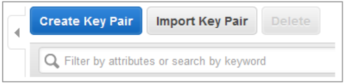
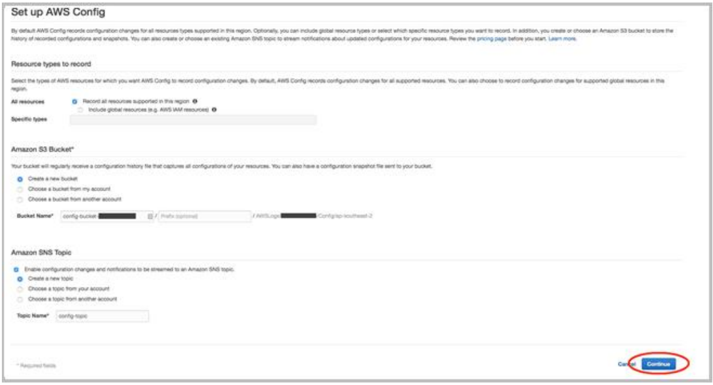
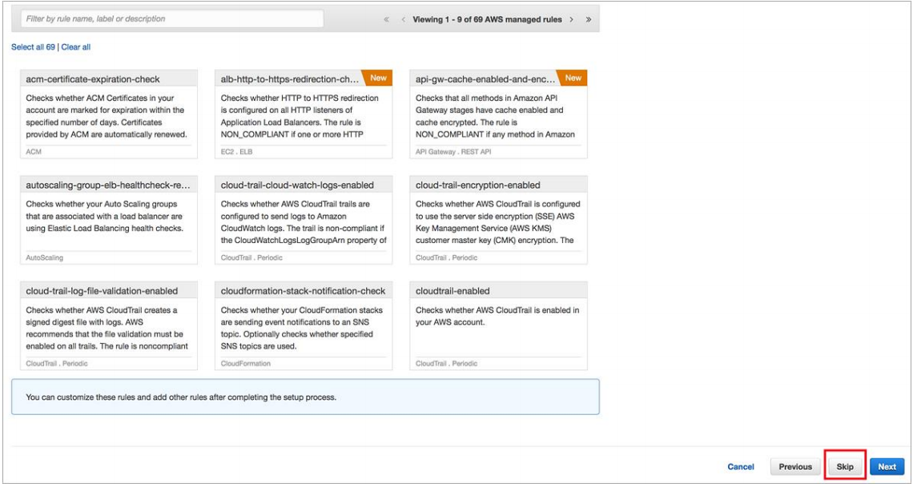

// If no preperation is required, remove all content from here

==== Prepare your AWS account

===== Create Amazon EC2 Key Pairs

Make sure that at least one Amazon EC2 http://docs.aws.amazon.com/AWSEC2/latest/UserGuide/ec2-key-pairs.html[key pair] exists within your AWS account *in the
Region you are planning to deploy the Quick Start in.*

. Open the Amazon EC2 console at https://console.aws.amazon.com/ec2/.
. Use the Region selector in the navigation bar to choose the AWS Region where you plan
to deploy.
. In the navigation pane, under *Network & Security*, choose *Key Pairs*.
. In the key pair list, verify that at least one available key pair (but preferably two
available key pairs) exist and make note of the key pair name or names. You’ll need to
provide a key pair name for the parameters `+pEC2KeyPairBastion+` (for bastion host login
access) and `+pEC2KeyPair+` (for all other Amazon EC2 host login access) when you launch 
the Quick Start. Although you can use the same key pair for both parameters, we
recommend that you use a different key pair for each.
+
If you want to create a new key pair, choose *Create Key Pair*. For additional
information, see the http://docs.aws.amazon.com/AWSEC2/latest/UserGuide/ec2-key-pairs.html#having-ec2-create-your-key-pair[Amazon EC2 documentation].

[#keypair1]
.Creating a Key Pair

NOTE: If you’re deploying the Quick Start for testing or proof of concept, we
recommend that you create a new key pair instead of specifying a key pair that’s already
being used by a production instance. 

===== Set up AWS Config

If AWS Config has not yet been initialized in the Region where you are deploying this Quick
Start, follow the steps below *in the Region where you are planning to deploy the
Quick Start*.

. Open the AWS Config console at https://console.aws.amazon.com/config/.
. Use the Region selector in the navigation bar to choose the AWS Region where you plan
to deploy.
. In the AWS Config console, choose *Get Started* (or *Get Started Now*). 
+
[#config1]
.AWS Config console
image::../images/config-1.png[config1]
+
. On the *Set up AWS Config* screen, you may leave all default values in place, or make
modifications as you see fit, and then choose *Continue*.
+
[#config2]
.AWS Config setup screen

+
. On the next screen, you are prompted to select rules for AWS Config. The centralized
logging template deploys rules for your environment and you can add more rules, or
remove rules, as you see fit. Choose *Skip* to proceed.
+
[#config3]
.Skip AWS Config rules selection

+
. On the Review screen, you review settings and confirm setup of AWS Config. To finish
setup, choose Confirm.

// ==== Prepare your {partner-company-name} account

// _Describe any setup required in the partner portal/account prior to template launch_

// ==== Prepare for the deployment

// _Describe any preparation required to complete the product build, such as obtaining licenses or placing files in S3_